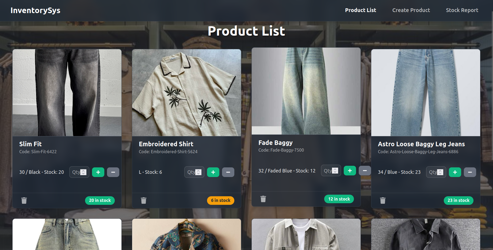
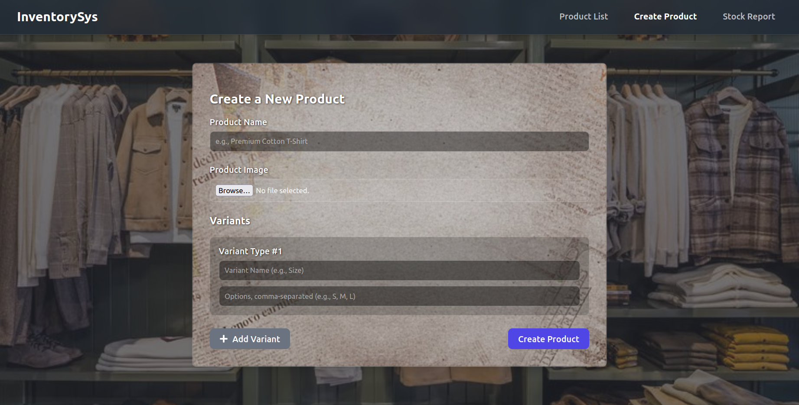
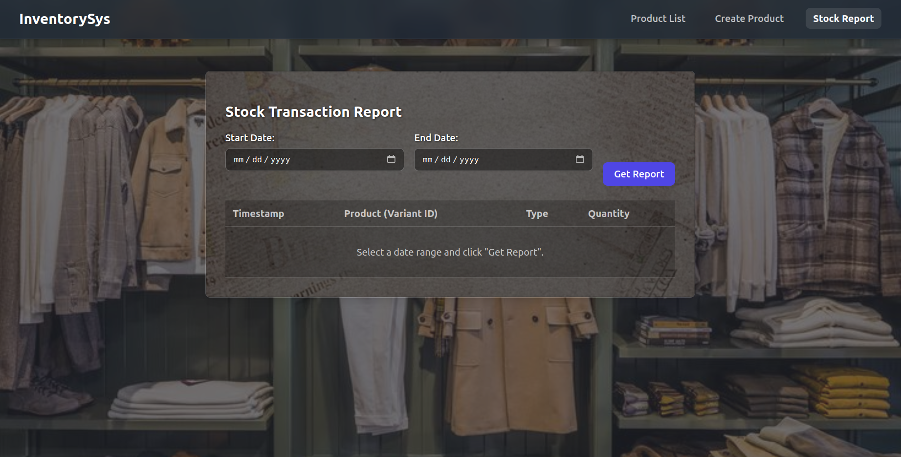

# 🛒 Product Inventory System

This is a **full-stack web application** designed as a machine test for an online store's inventory management. It features a robust **Django REST Framework** backend and a dynamic, modern **React.js** frontend with a "frosted glass" theme.

The application allows users to **create products** with multiple **variants**, **manage stock levels** in real-time through an interactive UI, and view detailed **transaction reports**.

---

## 📸 Live Demo Screenshots

### 🧾 Product Dashboard


### 🧾 Create Product Form


### 🧾 Stock Report Page


---

## ✨ Features

- **Dynamic Product Creation:** Create new products with customizable variants (e.g., Size, Color) and their options.
- **Interactive Product Dashboard:** View products in a modern card layout with images and stock info.
- **Real-time Stock Management:** Add (Purchase) or remove (Sell) stock directly from the product interface.
- **Detailed Transaction Reporting:** Track purchases and sales, filter by date, and view recent transactions.
- **Modern UI/UX:** Responsive and intuitive interface built with React.js and enhanced with `react-hot-toast` for instant feedback.

---

## 🛠 Tech Stack

- **Backend:** Python, Django, Django REST Framework
- **Frontend:** React.js, Axios, react-router-dom, react-hot-toast, react-icons
- **Database:** SQLite (default for Django development)

---

## ⚙️ Setup and Installation Instructions

### ✅ Prerequisites
- Python 3.x
- Node.js and npm

### 📁 1. Backend Setup (Django)
Open one terminal window for the backend:

```bash
# Navigate to backend directory
cd backend

# Create and activate virtual environment
python3 -m venv venv
source venv/bin/activate   # On Windows: venv\Scripts\activate

# Install dependencies
pip install -r requirements.txt

# Apply migrations
python manage.py migrate

# Run server
python manage.py runserver
```

The backend will be available at: **http://127.0.0.1:8000**

---

### 📁 2. Frontend Setup (React)
Open a second terminal window for the frontend:

```bash
# Navigate to frontend directory
cd frontend

# Install npm packages
npm install

# Start development server
npm start
```

Visit the app at: **http://localhost:3000**

---

## 🧠System Enhancements

### 1. Product Categories and Filtering
- Introduce a `Category` model in Django.
- Link it to the `Products` model using `ForeignKey`.
- Extend APIs to support category filters (e.g., `/api/products/?category=apparel`).
- Add name-based product search.

---

### 👨‍💻 Prepared By
**Pranav Mohan**